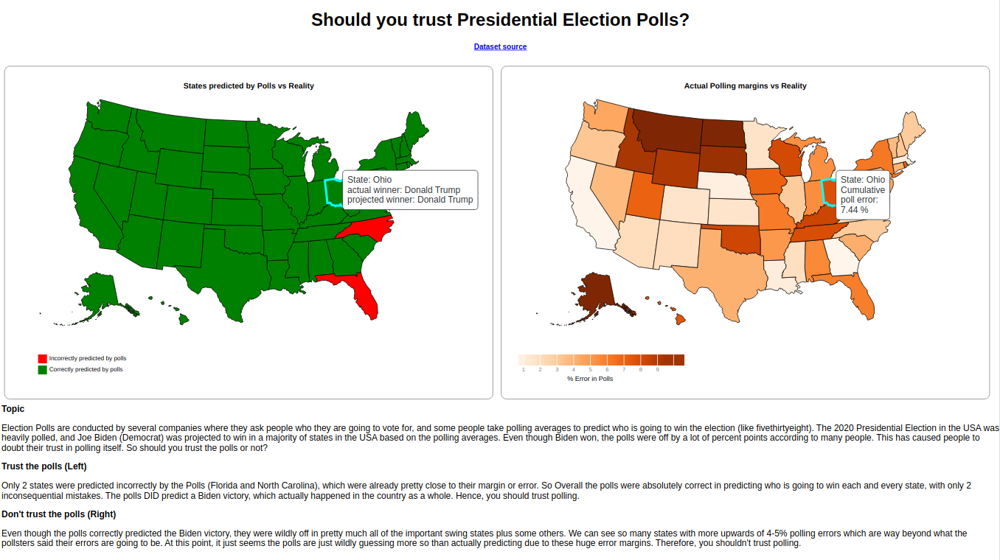

# Polling accuracy for US elections

This visualization uses the same dataset (aggregated from fivethirthyeight.com and Kaggle.com) to show 2 sides of the same story for polls in the 2020 Presidential election of the United States.

## Data preprocessing

The data was aggregated from public sources and preprocessed into a simple state-by-state level csv using Pandas and Jupyter noteboooks.

[Dataset source](https://www.kaggle.com/jiteshpabla/2020-election-data-polls-vs-actual)

## Design techniques

Using techniques from the data storytelling, I created two visualizations about a dataset that frame the data with opposite narratives.
The idea was to make it like a debate: one team argues the affirmative position, while the other argues the negative.

[This paper on visualization rhetoric](http://users.eecs.northwestern.edu/~jhullman/vis_rhetoric.pdf) provides an extensive collection of framing and styling techniques you can use to help frame a visualization to promote a specific viewpoint, story, or argument.

## Screenshot

